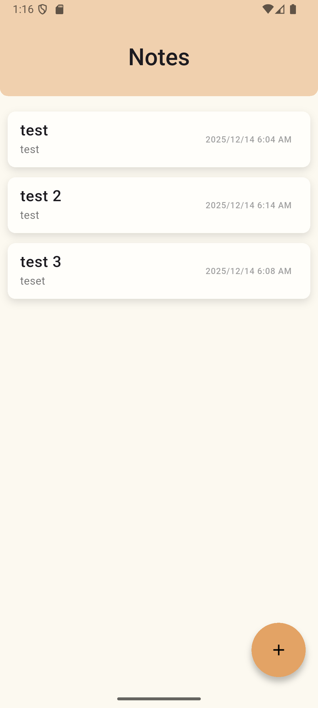
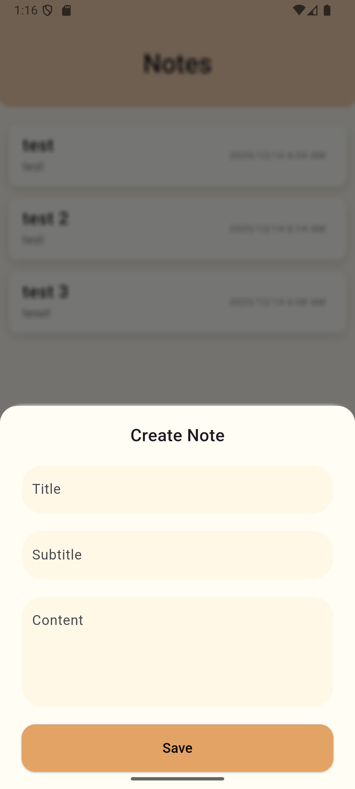
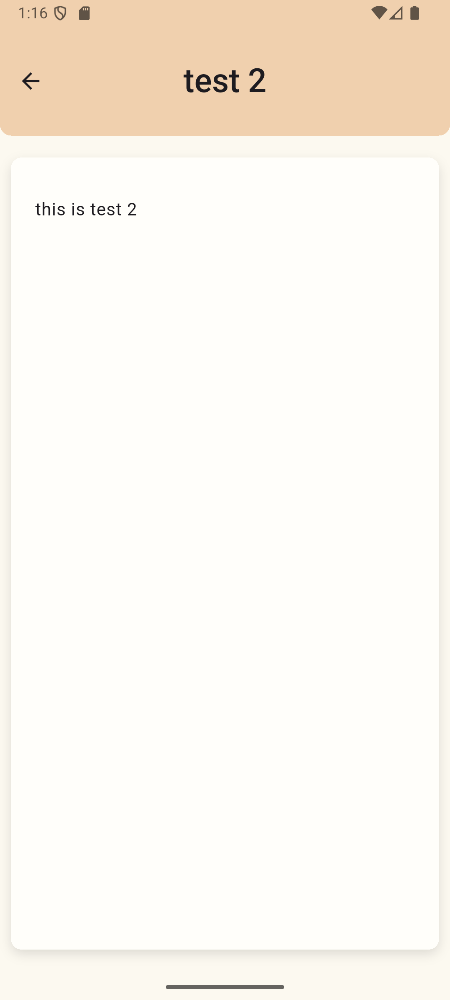

# 📝 Local Notes App

A simple and efficient offline note-taking application built with **Flutter** and **SQLite**.

Local Notes helps users write, store, and manage notes completely offline with fast performance, a clean UI and animations making the application lively.

---

## 🚀 Features

- ✅ Create, edit, and delete notes  
- ✅ Offline-first storage using SQLite  
- ✅ Local persistent database  
- ✅ Provider-based state management  
- ✅ Clean and scalable project structure  
- ✅ Lightweight and fast user experience  

---

## 🛠️ Technologies Used

- **Dart**
- **Flutter** (UI Framework)
- **SQLite** (Local Database)
- **Provider** (State Management)

---

## 📂 Project Structure

<pre>
    lib/
    ├── database/
    │ └── local_database.dart
    ├── models/
    │ └── notes.dart
    ├── screens/
    │ └── homepage.dart
    ├── listnotifier.dart
    └── main.dart
</pre>

---

## ⚙️ How It Works

- Notes are stored locally using SQLite.
- A `ListNotifier` class manages note state updates.
- UI automatically rebuilds when notes are added or removed.

## 📸 Screenshots
 

 

 

 
